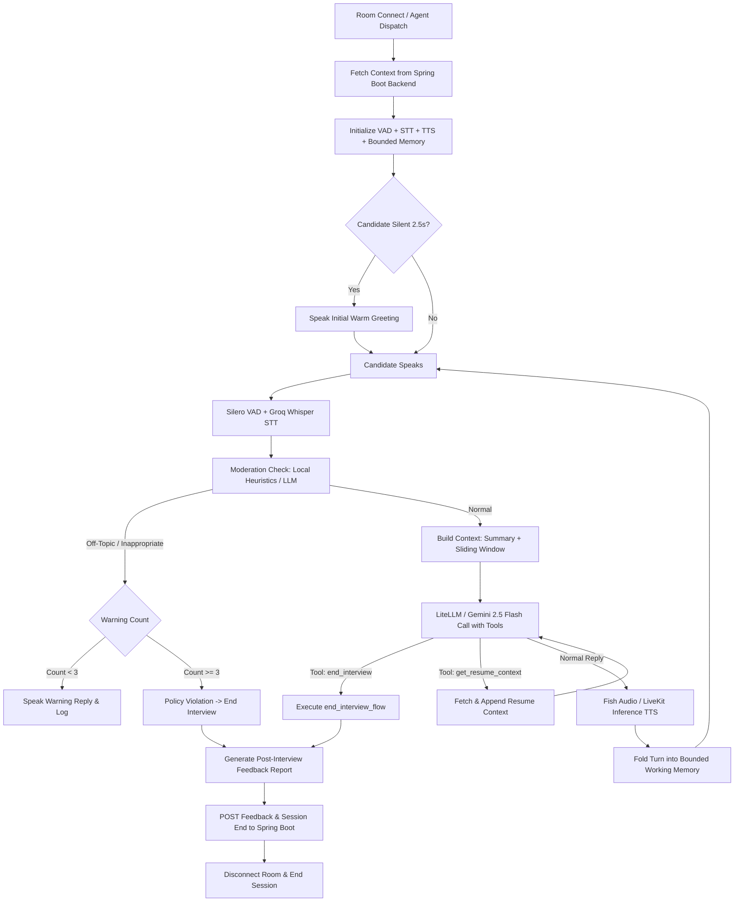
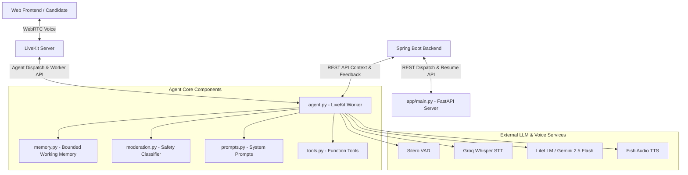

# 🤖 AI Voice Interview Agent & Resume Microservice

A standalone Python microservice and full-duplex conversational voice agent powering AI-driven technical job interviews.

---

## 🚀 Overview & Key Features

1. **LiveKit AI Voice Agent Worker (`agent.py`)** — Real-time voice interviewer with low-latency VAD, STT, LLM reasoning, Function Tool calling, and TTS.
2. **FastAPI Microservice (`app/`)** — Resume normalization (PDF text reconstruction), pre-flight job relevance screening, and explicit agent dispatching via LiveKit API.
3. **Bounded Working Memory (`memory.py`)** — Maintains a sliding window of recent turn pairs and folds older turns into a rolling summary to manage context size efficiently.
4. **Safety & Moderation (`moderation.py`)** — Fast local heuristics and LLM fallback to detect off-topic or inappropriate responses, with soft warning escalation and policy termination.
5. **Automated Evaluation Reporting** — Generates objective post-interview candidate feedback reports and posts them to the Spring Boot backend (`POST /api/ai-interview/{sessionId}/feedback`).

---

## 🔄 Agent Execution Flow

The voice agent executes a full-duplex conversational loop for every interview session:



---

## 🏗️ System Architecture & Code Structure



### 📁 Directory Layout

```
InterviewAgent/
├── app/
│   ├── controllers/          # FastAPI Router Endpoints
│   │   ├── health_controller.py      # Health Check Endpoint
│   │   ├── resume_controller.py      # Resume Normalization & Relevance Endpoints
│   │   └── dispatch_controller.py    # LiveKit Agent Dispatch Endpoint
│   ├── schemas/              # Pydantic Request & Response Schemas
│   │   └── resume_schema.py
│   ├── services/             # Resume Normalization & Relevance Service
│   │   └── resume_service.py
│   ├── config.py             # App Configuration & Environment Bindings
│   └── main.py               # FastAPI Microservice Entrypoint
├── agent.py                  # LiveKit Voice Agent Worker & Session Lifecycle
├── memory.py                 # Bounded Working Memory & Direct Turn Folding
├── moderation.py             # Local Heuristic & LLM Content Moderation
├── prompts.py                # System Prompts & Feedback Generation Templates
├── tools.py                  # LiveKit Function Tool Definitions (@llm.function_tool)
├── test_main.py              # Pytest Test Suite
├── requirements.txt          # Python Dependencies
└── README.md
```

---

## ⚙️ Setup & Running

### 1. Create & Activate Virtual Environment
```bash
python3 -m venv venv
source venv/bin/activate
```

### 2. Install Dependencies
```bash
pip install -r requirements.txt
```

### 3. Environment Configuration
Copy `.env.example` to `.env` and populate your credentials:
```env
GEMINI_API_KEY=your_gemini_api_key
OPENAI_API_KEY=your_openai_api_key
MODEL_NAME=gemini/gemini-2.5-flash
PORT=8000
LIVEKIT_URL=ws://127.0.0.1:7880
LIVEKIT_API_KEY=devkey
LIVEKIT_API_SECRET=secret
GROQ_API_KEY=your_groq_api_key
SPRING_BASE_URL=http://localhost:8080
INTERNAL_API_KEY=internal-secret-key
```

---

### 4. Run Services

#### FastAPI Microservice (Port 8000)
```bash
uvicorn app.main:app --reload --port 8000
```

#### LiveKit Voice Agent Worker
```bash
python agent.py dev
```

---

## 🧪 Running Unit Tests

```bash
pytest
```

---

## 🔗 API Endpoints Summary

- **GET `/health`**: Healthcheck (`{"status": "ok"}`)
- **POST `/resume/normalize`**: Reconstruct scrambled PDF text into structured Markdown
- **POST `/resume/check-relevance`**: Check candidate resume fit against target job title
- **POST `/dispatch-agent`**: Dispatch agent worker to a LiveKit room
- **Interactive Swagger Docs**: [http://127.0.0.1:8000/docs](http://127.0.0.1:8000/docs)
